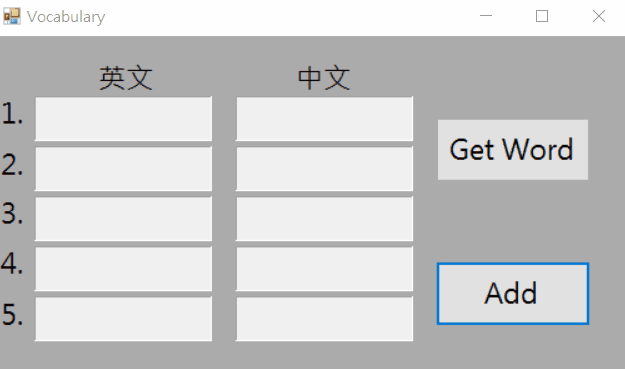

# Csharp_Vocabulary
英文單字紀錄程式，每次都跑出5個之前遇過且記不熟的英文單子，供使用者複習
# 程式設計流程
1. 利用Windows Form設計遊戲介面
2. 選寫紀錄單字的路徑，此專題是將單子計入在excel裡，若該位置沒有excel則建立一個
3. 建立控制excel的獨立函示庫，包含WriteCell. ReadCell and SaveFile...等等
4. 建立Get Word鈕，按下後則用亂數跑出5個不重複的數值，分別對應到excel該位置的單子，即為這次選擇要複習的單子
5. 建立Add鈕，顯示新視窗讓使用的輸入新的英文單子，下次便可隨亂數隨機出現

